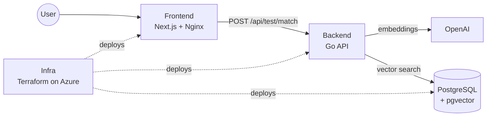

# ¿Qué sos de Gasti? — Frontend

> The web app of **¿Qué sos de Gasti?**, a 20-question personality quiz that uses AI embeddings to tell you which of Gasti's friends you are most similar to.


## The project

The project is split into three repositories:

| Repository | Role |
|---|---|
| **Frontend** (this repo) | Web app where users take the quiz and see their result |
| [**Backend**](https://github.com/GastonFerrarisDavies/QueSosDeGasti-backend) | Go API that turns the answers into an AI embedding and finds the closest match |
| [**Infra**](https://github.com/GastonFerrarisDavies/QueSosDeGasti-infra) | Terraform code that creates the Azure cloud environment and deploys the app |



## What this repo does

- **Landing page:** introduces the quiz and links to the test.
- **Quiz wizard:** shows the 20 questions one at a time, with a progress bar and back/next navigation.
- **Saves progress:** answers are kept in `sessionStorage`, so a page refresh doesn't lose them.
- **Calls the API:** sends the 20 answers to the [Backend](https://github.com/GastonFerrarisDavies/QueSosDeGasti-backend).
- **Result page:** shows the matched person, their description and a signature phrase.
- **Handles every state:** loading, error and retry, so users never see a blank page.

## Tech stack

| Area | Technology |
|---|---|
| Framework | Next.js (App Router), exported as a fully static site |
| UI | React, Tailwind CSS, mobile-first design |
| Language | TypeScript (strict type checking in CI) |
| Serving | Nginx (non-root container) |
| Packaging | Multi-stage Docker build with layer caching |
| CI | GitHub Actions → GitHub Container Registry (GHCR) |

## How it works

1. Questions are loaded from `public/q.json`, so they can be edited without touching the code.
2. When the user finishes, the frontend sends the answers to `POST /api/test/match` on the [Backend](https://github.com/GastonFerrarisDavies/QueSosDeGasti-backend).
3. The result is stored in `sessionStorage` and the user is taken to `/resultado`. The static export has no server, so this is how data moves between pages.

## Project structure

```
src/
├── app/
│   ├── page.tsx              # Landing page (/)
│   ├── test/page.tsx         # Quiz (/test)
│   └── resultado/page.tsx    # Result (/resultado)
├── components/QuizWizard.tsx # Quiz logic and UI
├── config/questions.ts       # Loads and types the questions
└── lib/
    ├── answers.ts            # Saves answers in sessionStorage
    └── api.ts                # Calls the Backend API
public/q.json                 # The 20 questions and their options
Dockerfile                    # Node build → Nginx runtime
nginx.conf                    # Static file serving config
```

## CI/CD

Every push to `main` runs [`.github/workflows/ci.yml`](.github/workflows/ci.yml):

1. **Check:** installs dependencies and runs the TypeScript type check.
2. **Build:** builds the Docker image and publishes it to GHCR.
3. **Deploy:** writes the new image digest into the [Infra](https://github.com/GastonFerrarisDavies/QueSosDeGasti-infra) repo. That commit triggers the Infra pipeline, which deploys the new version to Azure.

## Run locally

Requirements: Node.js 22 and the [Backend](https://github.com/GastonFerrarisDavies/QueSosDeGasti-backend) running on `http://localhost:8080`.

```bash
cp .env.example .env.local   # NEXT_PUBLIC_API_URL=http://localhost:8080
npm install
npm run dev                  # http://localhost:3000
```

With Docker:

```bash
docker build --build-arg NEXT_PUBLIC_API_URL=http://localhost:8080 -t quesosdegasti-frontend .
docker run -p 3000:8080 quesosdegasti-frontend
```

> `NEXT_PUBLIC_API_URL` is baked into the build. To point to a different API, rebuild the image.
